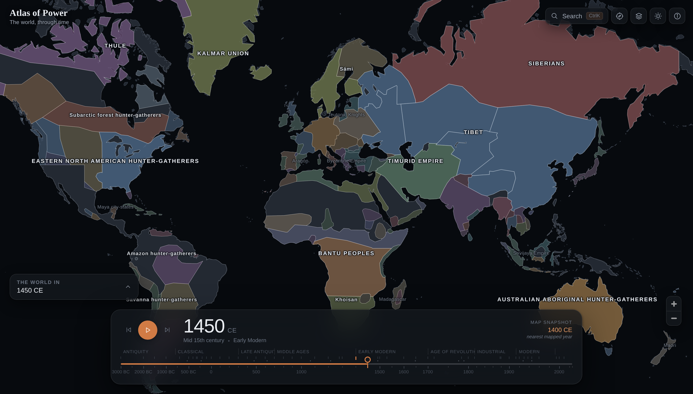

# Atlas of Power

An interactive map of human history. Move the timeline from **3000 BCE to 2026** and the
map redraws the political world of that year — realms in their own colours, the rulers and
figures recorded for that moment, and the events around it. Zoom in and smaller powers
surface beneath the large ones.



## What it does

- **Real historical borders** for ~50 mapped years. Colour identifies a realm and stays with
  it across every year; visual weight follows its mapped area, so scale reads through
  emphasis rather than louder colour. An empire and its vassals share a colour.
- **A timeline built for history, not for arithmetic.** The scale is non-linear — the last six
  centuries take roughly half the track, because that is where most mapped change happens.
  Ticks mark the years genuinely mapped, so the snapping is visible and deliberate.
- **Level of detail that rewards zooming.** A realm is labelled once it actually occupies
  enough of the screen, and people appear according to a prominence proxy, so a world view
  stays calm while a regional view fills with minor polities and lesser-known rulers.
- **Editorial panels** that cross-reference the data: open a ruler and the atlas shows who
  else held that realm and who was alive at the same time.
- **Search and a command palette** (`⌘K` / `Ctrl K`) across people, realms, events and years.
- **Light and dark**, full keyboard navigation, and a mobile layout that keeps the map dominant.

## Honest by construction

- Borders **snap** to the nearest mapped year rather than morphing between snapshots —
  interpolating them would invent a geography nobody recorded. The timeline always names the
  year being drawn.
- **Prominence** decides when a marker appears. It is a reference-count proxy (Wikipedia
  sitelinks for imported records), not a judgement of historical importance, and it carries
  the biases of its source. The interface says so wherever it is used.
- **Blank is not empty.** Land with no fill had no polity in this dataset for that year, which
  sometimes reflects history and often reflects the limits of the source.

## Run it

```bash
npm install
npm run dev        # http://localhost:5173
npm run build      # production build in dist/
npm run preview    # serve the build
```

The border layer (`public/data/`) is already built and committed. To regenerate it
from source (needs network access to GitHub):

```bash
npm run build:borders
```

## The people/events data — two phases

The app ships with a **curated starter set** of rulers, figures and events
(`src/data/highlights.json`) so it is populated out of the box.

For **comprehensive** coverage (thousands of rulers and figures with reign dates,
locations and portraits), run the **Wikidata import**:

```bash
npm run import:wikidata
```

This writes `public/data/rulers.json`, `figures.json`, `events.json` and downloads
portraits to `public/portraits/`. The app merges these over the curated set by id.

> **Network note.** The import needs access to `query.wikidata.org`, `www.wikidata.org`
> and `commons.wikimedia.org` / `upload.wikimedia.org`. Some managed/CI environments
> block these by policy — if so, run the import somewhere they are reachable (e.g. a
> local machine) and commit the generated files. The map and borders need none of this.

## Deploy to GitHub Pages

A workflow at `.github/workflows/pages.yml` builds with the correct base path and
publishes to Pages. Enable Pages for the repo (Settings → Pages → Source: GitHub
Actions). The build uses `BASE_PATH=/worldmap/`; data files are fetched via
`import.meta.env.BASE_URL`, so both local and Pages resolve correctly.

## Honest limits

- Borders are **snapshots**, not continuous — the map snaps to the nearest mapped year
  rather than morphing between them. Faking the in-between years would be inventing
  history.
- Coverage equals the source data's. Wikidata is large but incomplete and sometimes
  disputes dates; "every ruler" means every one it records with a usable date and place.
- Prominence is a **sitelink/fame proxy**, not a verdict on importance.

## Licence & credits

Distributed under **GPLv3** (`LICENSE`), because the border data it redistributes is
GPLv3. Full attribution for borders (historical-basemaps), land (Natural Earth),
people/events (Wikidata), portraits (Wikimedia Commons) and software is in
[`CREDITS.md`](CREDITS.md).
